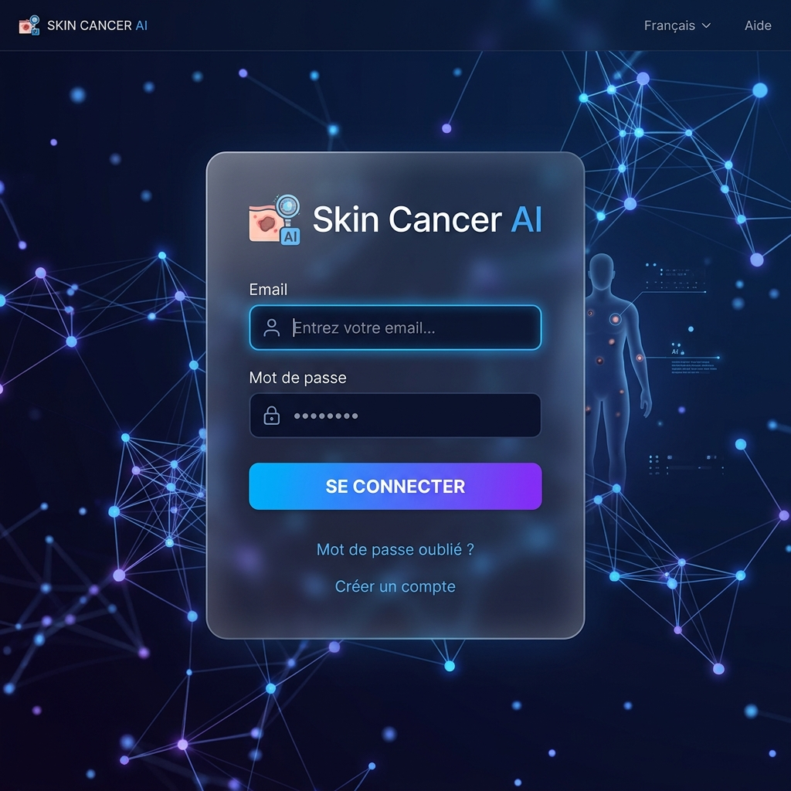
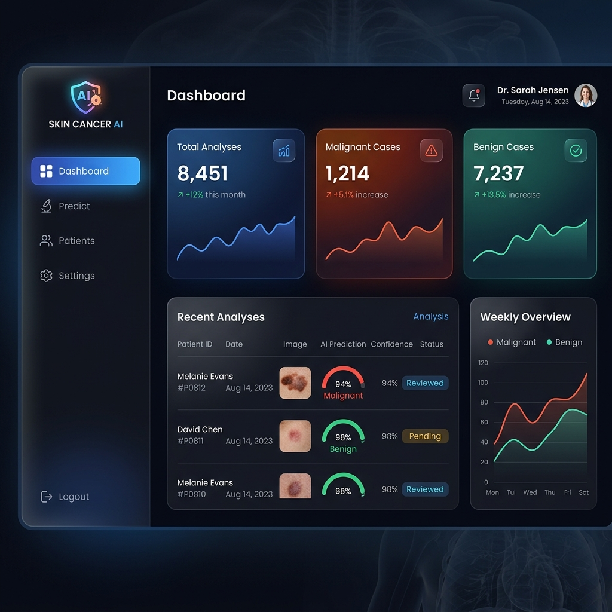
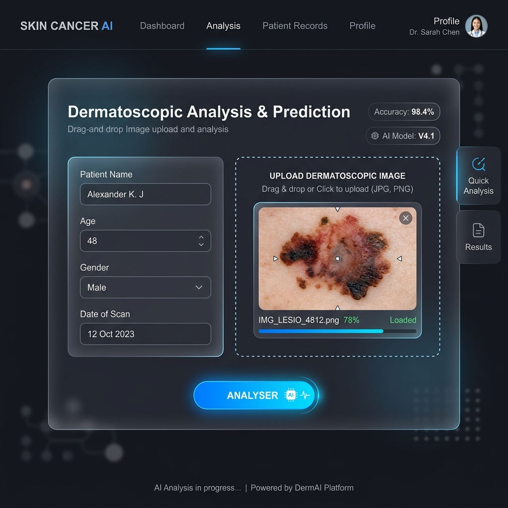
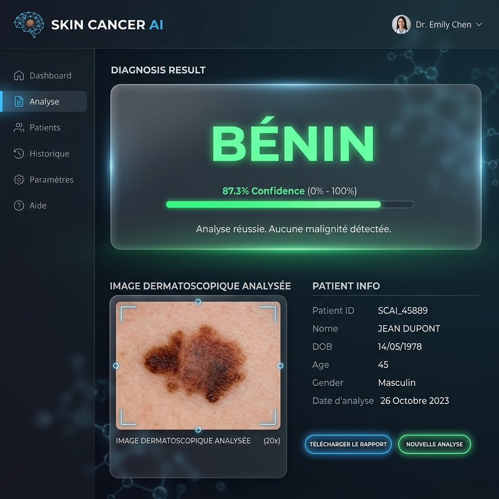
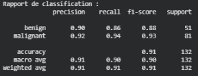
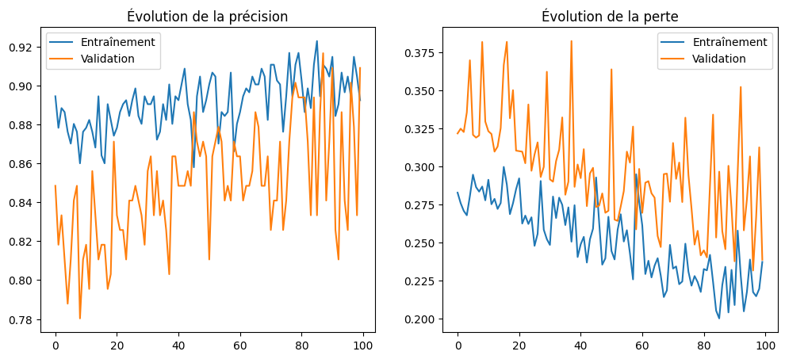
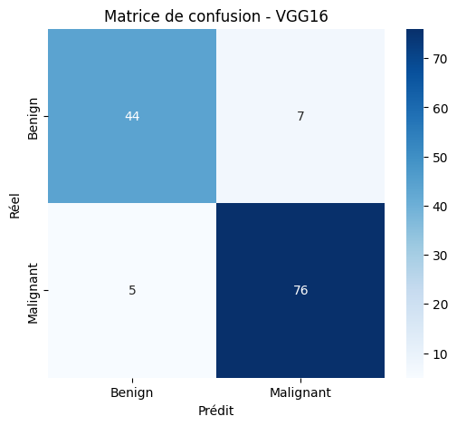

# 🩺 Skin Cancer AI — Diagnostic Assisté par Intelligence Artificielle

> Plateforme médicale complète de détection de cancer de la peau basée sur le Deep Learning (VGG16).  
> Interface moderne Flask + MySQL avec authentification, analyse d'image et suivi des patients.

---

## 📋 Description du Projet

**Skin Cancer AI** est une solution de diagnostic assisté par ordinateur qui intègre un modèle de Deep Learning (**VGG16** via Transfer Learning) dans une interface web moderne et intuitive. Le système permet aux cliniciens d'analyser des images dermatoscopiques et de classifier les lésions en deux catégories : **Bénin** ou **Malin**.

### Fonctionnalités Clés
- 🔐 **Authentification sécurisée** — système de login avec sessions Flask
- 📊 **Dashboard de pilotage** — statistiques globales des analyses
- 🔬 **Analyse IA** — prédiction instantanée sur image dermatoscopique
- 📁 **Suivi des patients** — historique complet en base de données MySQL
- 🎨 **UI moderne** — design glassmorphism, thème sombre premium

---

## 📸 Screenshots

### 1. Authentification

> Page de connexion avec animation de fond et design glassmorphism.

### 2. Dashboard

> Vue d'ensemble des statistiques et accès aux outils d'analyse.

### 3. Analyse Intelligente

> Formulaire de saisie patient et chargement d'image pour prédiction.

### 4. Résultat de Diagnostic

> Rapport généré par l'IA avec score de confiance en temps réel.

### 5. Rapport de Diagnostic PDF

> Rapport de diagnostic complet exportable pour le patient.

---

## 🏗️ Architecture du Projet

```
📁 SKIN_CANCER_APP/
├── 📄 app.py                  # Application Flask principale
├── 📄 setup_db.py             # Script d'initialisation de la BDD
├── 📄 database.sql            # Schéma SQL
├── 📄 requirements.txt        # Dépendances Python
├── 📁 model/
│   └── 📄 vgg16_skin_cancer.h5   # Modèle entraîné (à télécharger)
├── 📁 static/
│   ├── 📄 style.css           # Styles CSS
│   └── 📁 uploads/            # Images uploadées (ignoré par git)
├── 📁 templates/
│   ├── 📄 layout.html         # Template de base
│   ├── 📄 login.html          # Page d'authentification
│   ├── 📄 dashboard.html      # Tableau de bord
│   ├── 📄 predict.html        # Page d'analyse
│   ├── 📄 result.html         # Résultat de diagnostic
│   └── 📄 patients.html       # Liste des patients
└── 📁 screenshots/            # Captures d'écran de l'application
```

---

## 🛠️ Technologies Utilisées

| Catégorie | Technologie |
|-----------|-------------|
| **Backend** | Flask (Python) |
| **ML / IA** | TensorFlow, Keras (VGG16 Transfer Learning) |
| **Data** | NumPy, Pillow |
| **Base de Données** | MySQL |
| **Frontend** | HTML5, CSS3 (Glassmorphism), Vanilla JS |

---

## 🚀 Installation Locale

### Prérequis
- Python 3.10+
- MySQL Server
- Git

### Étapes

**1. Cloner le projet**
```bash
git clone https://github.com/<votre-username>/SKIN_CANCER_APP.git
cd SKIN_CANCER_APP
```

**2. Créer un environnement virtuel**
```bash
python -m venv .venv
.venv\Scripts\activate       # Windows
# source .venv/bin/activate  # Linux/Mac
```

**3. Installer les dépendances**
```bash
pip install -r requirements.txt
```

**4. Configurer la base de données MySQL**

Créez un fichier `.env` à la racine :
```env
MYSQL_HOST=localhost
MYSQL_USER=root
MYSQL_PASSWORD=votre_mot_de_passe
MYSQL_DATABASE=skin_cancer_db
```

Puis initialisez la base de données :
```bash
python setup_db.py
```
ou importez directement `database.sql` dans MySQL.

**5. Télécharger le modèle**

Le modèle entraîné `.h5` (~500 Mo) est disponible sur Google Drive :  
👉 [Télécharger vgg16_skin_cancer.h5](https://drive.google.com/file/d/12XF6OPGURb9wIqkE9kgjsDeZzj8MDbwx/view?usp=sharing)

Placez-le dans :
```
model/vgg16_skin_cancer.h5
```

**6. Lancer l'application**
```bash
python app.py
```

Accédez à : [http://localhost:5000](http://localhost:5000)

---

## 🧠 Le Modèle & Résultats

### Architecture VGG16
Le modèle est basé sur l'architecture **VGG16**, optimisée par **Transfer Learning**. Il analyse les caractéristiques morphologiques des lésions pour fournir un diagnostic de précision.

- **Entrée** : Images 224x224 pixels.
- **Sortie** : Classification (Bénin / Malin) avec score de confiance.

### 📊 Performances Réelles
Voici les résultats obtenus après l'entraînement du modèle :

#### 📈 Courbes d'Entraînement

> Évolution de la précision et de la perte sur 100 époques.

#### 🎛️ Matrice de Confusion

> Matrice de confusion montrant la performance de classification (Bénin vs Malin).

---

## 📦 Structure de la Base de Données

```sql
-- Table utilisateurs
CREATE TABLE users (
    id INT AUTO_INCREMENT PRIMARY KEY,
    username VARCHAR(100),
    password VARCHAR(255)
);

-- Table patients
CREATE TABLE patients (
    id INT AUTO_INCREMENT PRIMARY KEY,
    name VARCHAR(100),
    age INT,
    result VARCHAR(50),
    probability FLOAT,
    image_path VARCHAR(255),
    created_at TIMESTAMP DEFAULT CURRENT_TIMESTAMP
);
```

---

## ⚠️ Sécurité

- Le fichier `.env` (credentials MySQL) est exclu du dépôt via `.gitignore`
- Le dossier `model/` (fichiers `.h5`) est exclu pour raison de taille
- Le dossier `static/uploads/` (images patients) est exclu pour confidentialité

---

## 👤 Auteur

Projet développé dans le cadre d'une application de diagnostic médical assisté par IA.

---

*Skin Cancer AI · Diagnostic de Précision · 2026*
